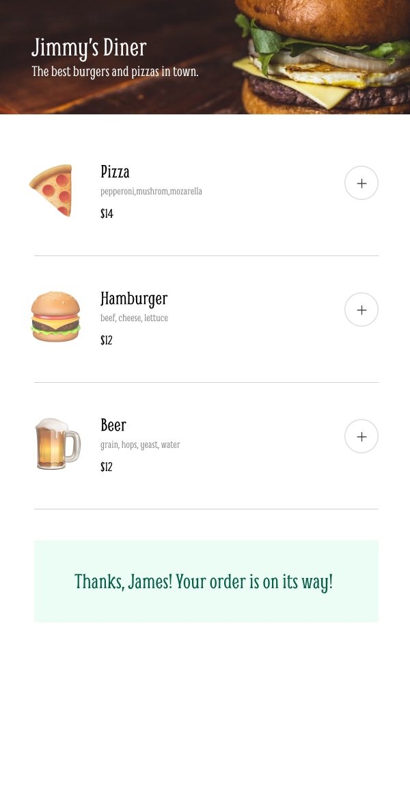

# co72e499baf5f48346e5975cf

Quick start:

```
$ npm install
$ npm start
```

# Mobile Restaurant Menu

[Scrimba](https://scrimba.com/)'s solo project. The goal of this project was to create an app to order from a restaurant menu.

## Preview



## Project walkthrough

1. First add items to create an order.
2. If you are happy with the order click "Complete order".
3. Fill out name, credit card number and CVV in order to be able to make the order. After that click "Complete order".
4. Your order has been submitted.
5. Review your experience.

## About Scrimba

At Scrimba our goal is to create the best possible coding school at the cost of a gym membership! 💜
If we succeed with this, it will give anyone who wants to become a software developer a realistic shot at succeeding, regardless of where they live and the size of their wallets 🎉
The Frontend Developer Career Path aims to teach you everything you need to become a Junior Developer, or you could take a deep-dive with one of our advanced courses 🚀

- [Our courses](https://scrimba.com/allcourses)
- [The Frontend Career Path](https://scrimba.com/learn/frontend)
- [Become a Scrimba Pro member](https://scrimba.com/pricing)

Happy Coding!
